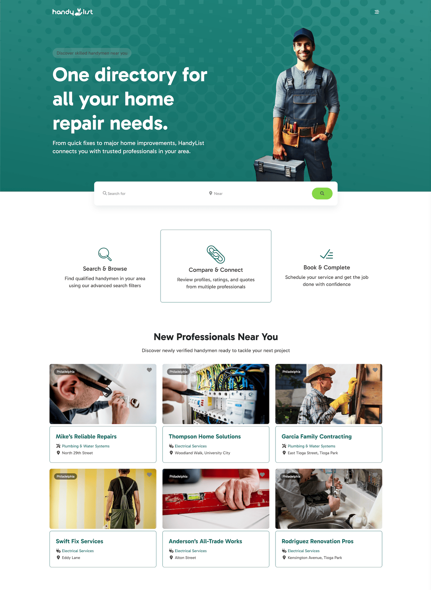

# HandyList theme for BlockStrap

   
   

Showcase trusted local tradespeople with HandyList, a home repair service directory featuring reviews, specialties, and contact details—a fast, responsive WordPress theme powered by Bootstrap and Blockstrap for easy customization.

* Tested up to: 6.2
* Requires at least: 6.1
* Requires PHP: 7.2
* Version: 0.0.1
* License: GPLv2 or later
* License URI: http://www.gnu.org/licenses/gpl-2.0.html

## Changelog

#### 0.0.1
*  First public release - RELEASE

## Copyright

HandyList WordPress Theme, Copyright AyeCode Ltd
HandyList is distributed under the terms of the GNU GPL.

This program is free software: you can redistribute it and/or modify
it under the terms of the GNU General Public License as published by
the Free Software Foundation, either version 2 of the License, or
(at your option) any later version.

This program is distributed in the hope that it will be useful,
but WITHOUT ANY WARRANTY; without even the implied warranty of
MERCHANTABILITY or FITNESS FOR A PARTICULAR PURPOSE. See the
GNU General Public License for more details.

## Authors

- [@RachidBray](https://www.github.com/RachidBray)
- [@ayecode](https://www.github.com/ayecode)

## Resources used to build this theme

### Icons
- https://www.svgrepo.com/svg/148952/link?edit=true
- https://www.svgrepo.com/svg/457346/search?edit=true
- https://www.svgrepo.com/svg/390953/finished?edit=true
- https://www.svgrepo.com/svg/473380/shield-check?edit=true
- https://www.svgrepo.com/svg/194528/lightning-flash?edit=true

### Images
- https://pxhere.com/en/photo/1691914
- https://pxhere.com/en/photo/1699818
- https://pxhere.com/en/photo/1056726
- https://pxhere.com/en/photo/1000772
- https://pxhere.com/en/photo/1324056
- https://pxhere.com/en/photo/1056728
- https://pxhere.com/en/photo/1324058
- https://pxhere.com/en/photo/713854
- https://pxhere.com/en/photo/1700100

### Background Patterns
- https://svgsilh.com/image/744404.html